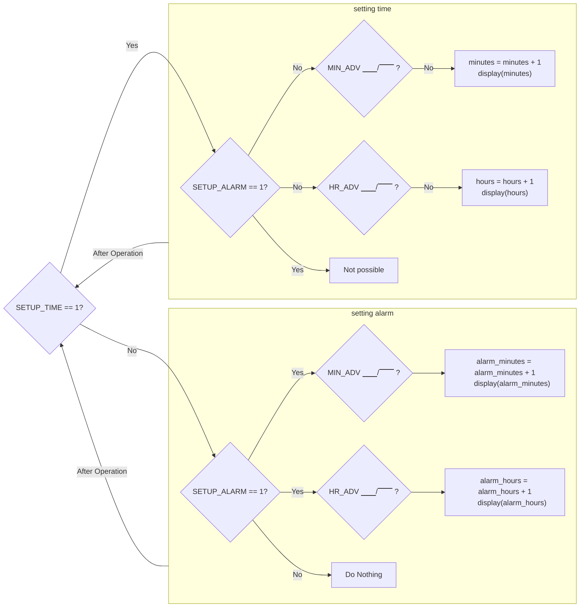
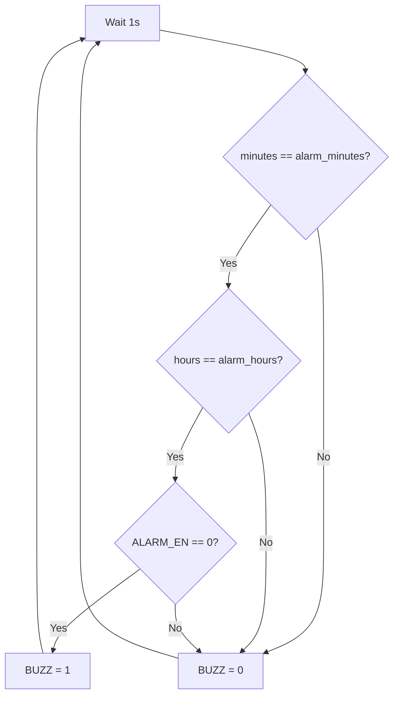

# The Alarm System
{: .no_toc}

## Contents
{: .no_toc .text-delta}

1. TOC
{:toc}

---

With a working clock, you decide to make it an **alarm** clock.
You think deeply about what are the major components of making an alarm work, and decided that there are two; setting the alarm and sounding the alarm.

With the ideas still fresh in your mind, you create the flowchart in [Figure 3](#figure-3) that combines the setting logic of your clock alongside with the logic for setting the alarm functionality.
You then also think about how to create a mechanism for the alarm to sound on the set time, and with that in mind you create another flowchart for you to use in [Figure 4](#figure-4).

However, you are still stumped on how to store the alarm time, but you figure that you can just create another `BabylonianClock` component to store the information that you want.


## Goals

1. Learn how to use *Digital*
2. Add the following functionality to your clock:
    - Setting the alarm time
    - Sounding the alarm when the time has been reached

## Instructions

All of your work should be in the same circuit from the [previous section](/docs/lab1/part1/the_clock) called `ConventionalAlarmClock` (it will save as `ConventionalAlarmClock.dig`).

Your task is to add alarm functionalities to your existing clock.

If you refer to the [circuit structure](/docs/lab1/part1#circuit-structure), there are a couple of important inputs to keep in mind for this section:
- `ALARM_EN`
- `SETUP_ALARM`
- `MIN_ADV`
- `HR_ADV`

### Setting Alarm Operation

{: .note}
The `SETUP_TIME` and `SETUP_ALARM` could be high at the same time.
If this does happen, then your circuit should return back to normal operation (i.e. continue counting like normal).

To store the counters of the variable, you can **repurpose the `BabylonianClock` component by tying some signals to 0 and some signals elsewhere**.

During the setting time operation, the `SETUP_ALARM` **signal will be high**.
While this signal is set high, the external clock input (`CLK`) **should not modify the stored time in any way**.
During this operation, the advance signals (`MIN_ADV` or `HR_ADV`) can be set high.
On rising edges of these signals (i.e. the signal goes from 0 to 1), then the corresponding counter storing the value for the alarm should be incremented by 1.

#### Example

Suppose the clock is at `00:00:54`.
Suppose that the alarm time set is `00:00:00`.
Suppose that we get the following input waveform:

```
CLK        : ⎽⎽/⎺⎺\⎽⎽/⎺⎺\⎽⎽/⎺⎺\⎽⎽
SETUP_TIME : ⎺⎺⎺⎺⎺\⎽⎽⎽⎽⎽⎽⎽⎽⎽⎽⎽⎽⎽⎽
SETUP_ALARM: ⎺⎺⎺⎺⎺⎺⎺⎺⎺⎺⎺⎺⎺⎺⎺⎺⎺⎺⎺⎺
MIN_ADV    : ⎽⎽/⎺⎺\⎽⎽/⎺⎺\⎽⎽/⎺⎺⎺⎺⎺
HR_ADV     : ⎽⎽⎽⎽⎽/⎺⎺\⎽⎽/⎺⎺⎺⎺⎺⎺⎺⎺
```

Then the final time the clock should display is `00:00:55` as both `SETUP_TIME` and `SETUP_ALARM` were high, which means that the clock reverted back to normal operation, and since one rising edge of the clock occurred, we increment the seconds by one.
However, since we then set `SETUP_TIME` low, that means we are operating in the setup alarm mode.

The alarm value that should be stored is `02:02:00` as:
1. We ignore the first rising `MIN_ADV` since it is during when both `SETUP_TIME` and `SETUP_ALARM` are high.
2. We have 2 rising edges of `MIN_ADV` remaining.
3. We have 2 rising edges of `HR_ADV` remaining.

Please modify your previous logic to account for this new setting logic.

### Displaying the Alarm

It would be beneficial for the user to see what the current saved alarm is while they are in the setup mode.
So, **while `SETUP_ALARM` is set high, you should display the `ALARM_MINUTES` and `ALARM_HOURS` values on the seven segment displays**.
Since the alarm we implement doesn't support seconds, please display 0 for the seconds place.
When `SETUP_ALARM` is low, then the `SECONDS`, `MINUTES`, and `HOURS` signals should be sent to the seven segment displays.

Please modify your display logic to account for this.

### Buzzing the Alarm

The last key piece for making an alarm clock work is to provide a `BUZZ` signal so that the TickTok Audio Team can use it to play a song while waking the user up (based on their personal harvested data of course).
During normal operation, whenever the `MINUTES` == `ALARM_MINUTES` and the `HOURS` == `ALARM_HOURS` and `ALARM_EN == 0`, then the `BUZZ` signal should be set high.

Please add the logic to handle this.

## Figures

### Figure 3
Setting the Alarm Clock
{: .text-delta}


### Figure 4 
Setting the Alarm Clock
{: .text-delta}

