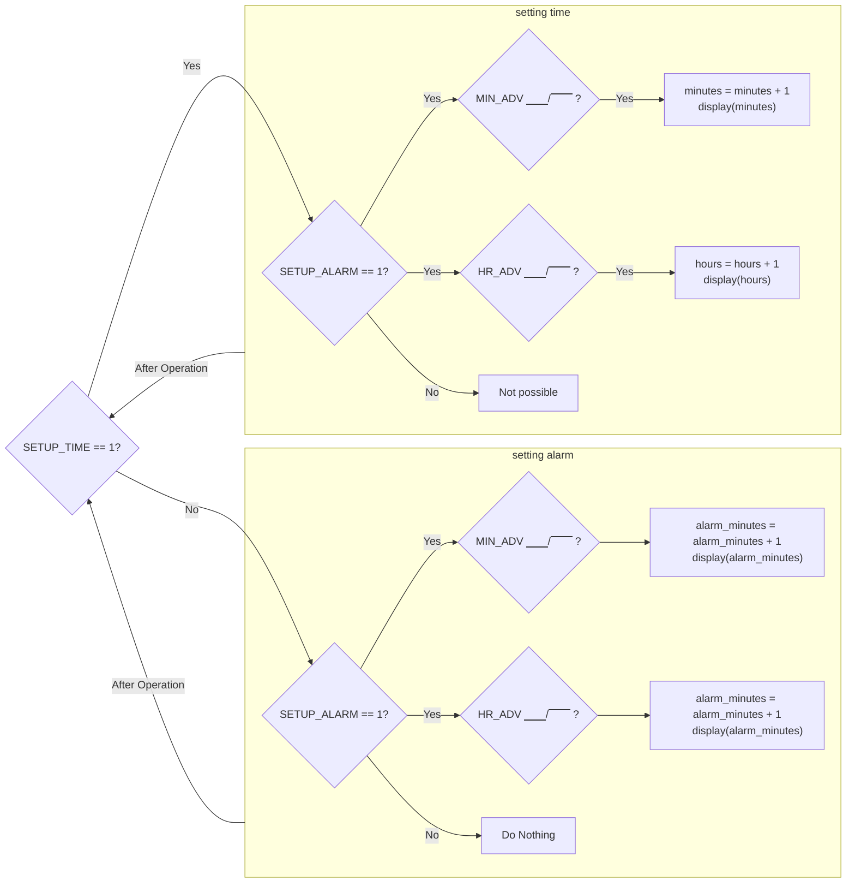
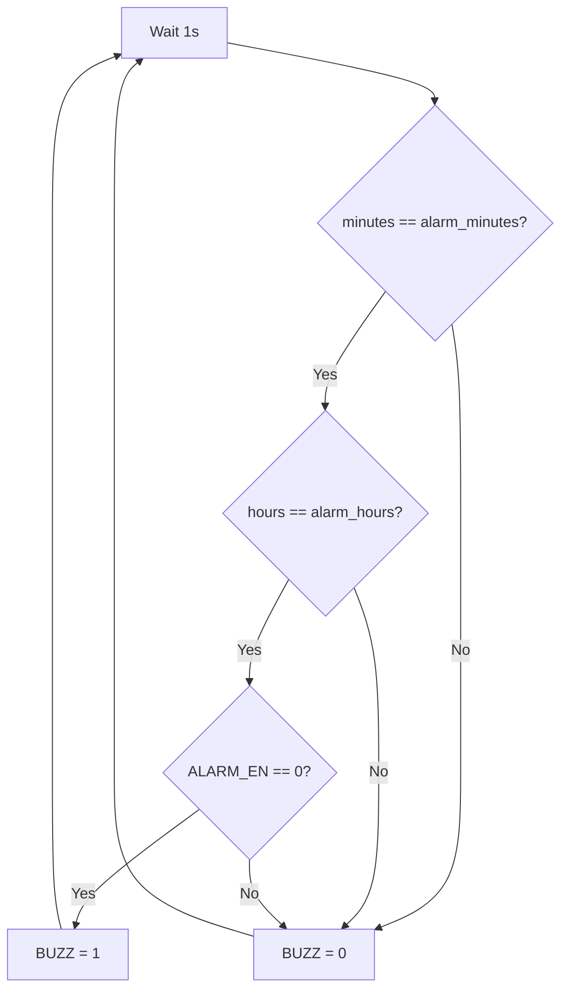

# The Alarm System
{: .no_toc}

## Contents
{: .no_toc .text-delta}

1. TOC
{:toc}

---

With a working clock, you decide to make it an **alarm** clock.
You think deeply about what are the major components of making an alarm work, and decided that there are two; setting the alarm and sounding the alarm.

With the ideas still fresh in your mind, you create the flowchart in [Figure 1](#figure-1) that combines the setting logic of your clock alongside with the logic for setting the alarm functionality.
You then also think about how to create a mechanism for the alarm to sound on the set time, and with that in mind you create another flowchart for you to use in [Figure 2](#figure-2).

However, you are still stumped on how to store the alarm time, but you figure that you can just create another `BabylonianClock` component to store the information that you want.

## Goals

1. Learn how to use *Digital*
2. Add the following functionality to your clock:
    - Setting the alarm time
    - Sounding the alarm when the time has been reached

## Figures

### Figure 1
Setting the Alarm Clock
{: .text-delta}

### Figure 2 
Setting the Alarm Clock
{: .text-delta}

