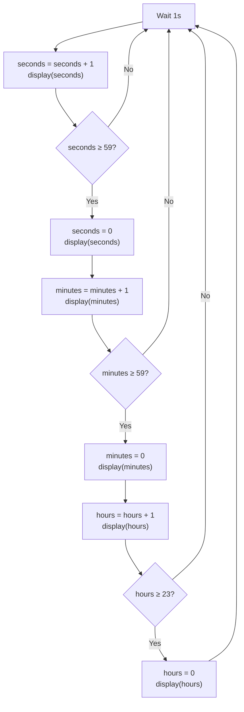
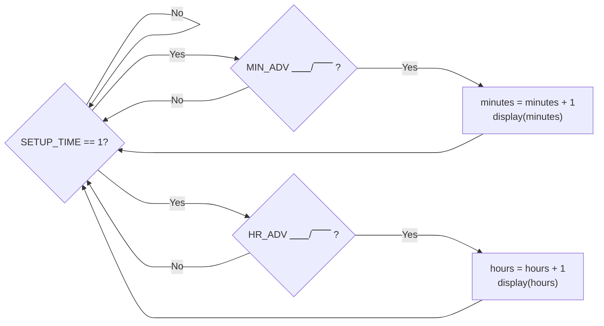

# The Clock System
{: .no_toc}

## Contents
{: .no_toc .text-delta}

1. TOC
{:toc}

---

In your quest to master digital clockmaking, you discover that an alarm clock has two essential functions: displaying the current time and sounding an alarm at a set time.
Being a smart computer engineer, you decide to first tackle the base problem, creating a clock.
Quickly, you realize that creating a clock is no easy feat, but luckily your mentor provided you some diagrams for you to better understand the "complex" workings for a clock.

[Figure 1](#figure-1) provides a nice outline for the flow of a clock, but you then question what would happen if the clock loses power?
Ever the eager apprentice, you are two steps ahead, and propose a plan of allowing the user to manually set the alarm time.
Your mentor however is three steps ahead of you, and reveals yet another flowchart ([Figure 2](#figure-2)) on how to properly implement the time setting logic.

The last question prying at the back of your mind is how to create a "variable" of sorts in hardware?
Your mentor, seeing your distant gaze provides you with a final gift before letting you work.
He provides you with a `BabylonianClock` component, a clock that perfectly encapsulates the logic in [Figure 1](#figure-1) for you!

Feeling a renewed sense confidence, you thank your mentor and set out to create the setting logic detailed in [Figure 2](#figure-2).

## Goals

1. Learn how to use *Digital*
2. Create a clock capable of:
    - Displaying the current time
    - Setting the current time

## Instructions

All of your work should be in a new circuit called `ConventionalAlarmClock` (it will save as `ConventionalAlarmClock.dig`).

You are given a `BabylonianClock` component, which implements the logic discussed in [Figure 1](#figure-1).
Your task is to implement a scaffolding around this component which allows the user to manually set the minutes and hours of the clock.

If you refer to the [circuit structure](/docs/lab1/part1#circuit-structure), there are a couple of important inputs to keep in mind:
- `CLK`
- `CLR`
- `SETUP_TIME`
- `MIN_ADV`
- `HR_ADV`

### Normal Operation

The normal operation of the clock is defined to be **the period where no `SET` signals are high**.
During this period, the clock will tick away as per [Figure 1](#figure-1), keeping track of time like we would expect a clock to.

Please wire up the correct inputs to the `BabylonianClock` to observe this normal operation.

### Setting Time Operation

During the setting time operation, the `SETUP_TIME` **signal will be high**.
While this signal is set high, the external clock input (`CLK`) **should not modify the stored time in `BabylonianClock` in any way**.
During this operation, the advance signals (`MIN_ADV` or `HR_ADV`) can be set high.
On rising edges of these signals (i.e. the signal goes from 0 to 1), then the corresponding counter storing the value should be incremented by 1.

#### Example

Suppose the clock is at `00:00:54` and in setup mode.
Suppose that we get the following input waveform:

```
CLK    : ⎽⎽/⎺⎺\⎽⎽/⎺⎺\⎽⎽/⎺⎺\⎽⎽/
MIN_ADV: ⎽⎽/⎺⎺\⎽⎽/⎺⎺\⎽⎽/⎺⎺⎺⎺⎺⎺
HR_ADV : ⎽⎽⎽⎽⎽/⎺⎺\⎽⎽/⎺⎺⎺⎺⎺⎺⎺⎺⎺
```

Then the final time the clock should display is `02:03:54` as:
1. Being in setup mode means that the clock doesn't advance the seconds anymore
2. `MIN_ADV` had 3 rising edges, hence we have incremented by 3 minutes
3. `HR_ADV` had 2 rising edges, hence we have incremented by 3 hours

Please wire up the correct inputs to the `BabylonianClock` to observe this setting time operation.

### Displaying the Time
{: h2}

To display the time, we will be utilizing [Seven Segment Displays](https://en.wikipedia.org/wiki/Seven-segment_display).
The TickTok Display Team has provided you with a `SevenSegmentDecoder` component.

Please wire up the correct inputs to the `SevenSegmentDecoder` and export the correct outputs.

## Figures

### Figure 1
Clock Logic Flowchart
{: .text-delta}




### Figure 2
Setting Time Flowchart
{: .text-delta}

{: .note}
The symbol `⎽⎽/⎺⎺` denotes a rising edge, or when the signal goes from a 0 to a 1.
Similarly, the symbol `⎺⎺\__` denotes a falling edge, or when the signal goes from a 1 to a 0.


