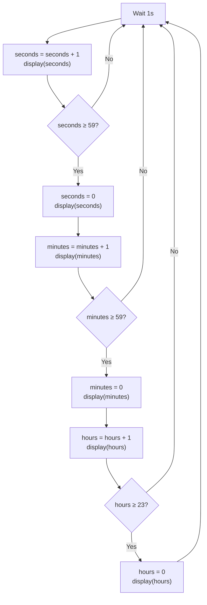
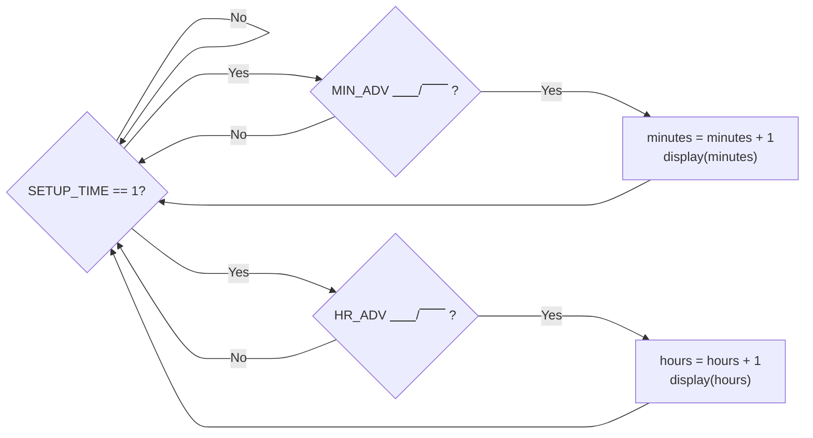

# The Clock
{: .no_toc}

## Contents
{: .no_toc .text-delta}

1. TOC
{:toc}

---

In your quest to master digital clockmaking, you discover that an alarm clock has two essential functions: displaying the current time and sounding an alarm at a set time.
Being a smart computer engineer, you decide to first tackle the base problem, creating a clock.
Quickly, you realize that creating a clock is no easy feat, but luckily your mentor provided you some diagrams for you to better understand the "complex" workings for a clock.

[Figure 1](#figure-1) provides a nice outline for the flow of a clock, but you then question what would happen if the clock loses power?
Ever the eager apprentice, you are two steps ahead, and propose a plan of allowing the user to manually set the alarm time.
Your mentor however is three steps ahead of you, and reveals yet another flowchart ([Figure 2](#figure-2)) on how to properly implement the time setting logic.

The last question prying at the back of your mind is how to create a "variable" of sorts in hardware?
Your mentor, seeing your distant gaze provides you with a final gift before letting you work.
He provides you with a `BabylonianClock` component, a clock that perfectly encapsulates the logic in [Figure 1](#figure-1) for you!

Feeling a renewed sense confidence, you thank your mentor and set out to create the setting logic detailed in [Figure 2](#figure-2).

## Goals

1. Learn how to use *Digital*
2. Create a clock capable of:
    - Displaying the current time
    - Setting the current time

## Figures

### Figure 1
Clock Logic Flowchart
{: .text-delta}

### Figure 2
Setting Time Flowchart
{: .text-delta}

{: .note}
The symbol `⎽⎽/⎺⎺` denotes a rising edge, or when the signal goes from a 0 to a 1.
Similarly, the symbol `⎺⎺\__` denotes a falling edge, or when the signal goes from a 1 to a 0.

