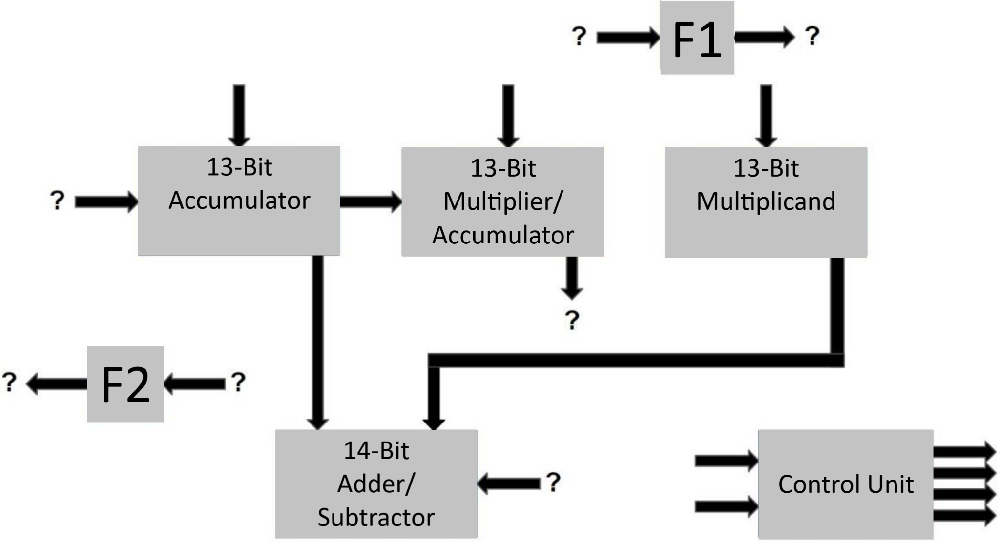

# Booth's Multiplier: Step 1
{: .no_toc}

## Contents
{: .no_toc .text-delta}

1. TOC
{:toc}

---

## Implementing a Booth's Multiplier

Figure 2 below shows an incomplete schematic of a Booth's Multiplier with 13-bit inputs and a 26-bit output.
The output is contained within the concatenation of the Accumulator with the Multiplier/Accumulator registers.
The arrows pointing down into the 13-bit Multiplicand and the 13-bit Multiplier/Accumulator register pair indicate where the inputs to the algorithm are initially loaded.
The Adder/Subtractor module is also shown with its inputs, but the output is not shown.
Its output, along with the other glue logic indicated by the floating arrows with question marks, must be implemented and connected by you.
More details about the`Control Unit`, and what its inputs/outputs are used for, can be found in the [Provided Components](https://cse140l.github.io/fa24-labs/docs/lab2/part1/provided_components) section.

#### Figure 2

{: .text-delta}
Incomplete Datapath for Booth's Multiplier

You should be ready to complete this schematic by filling in the missing glue logic.
Specifically, you must implement glue logic determining the following:
- When the Accumulator register should "Load" a new value
- Whether the Adder-Subtractor should add or subtract
- What bit should be shifted into the Accumulator.
You should additionally complete the interconnections among the components since, as you can see, a number of components are floating unconnected to the rest, and not all inputs/outputs are shown.
We recommend that the Flip Flop F1 (as well as F2) be implemented using the *Digital* `D-Flip-Flop` component, as this component is sufficient for the various needed functionalities for this task without cluttering the design with unnecessary extra functionalities.

{: .highlight-title}
> Lab Report
>
> **Explain:**
> - Your behavioral design for the multiplier
> - Your reasoning about the glue logic
> - How you came to develop the glue logic
> - Your derivation of logic determining the Add/Subtract signal
> - The `LOAD` input of the Accumulator
> - THe `SHIFT_IN` input of the Accumulator
