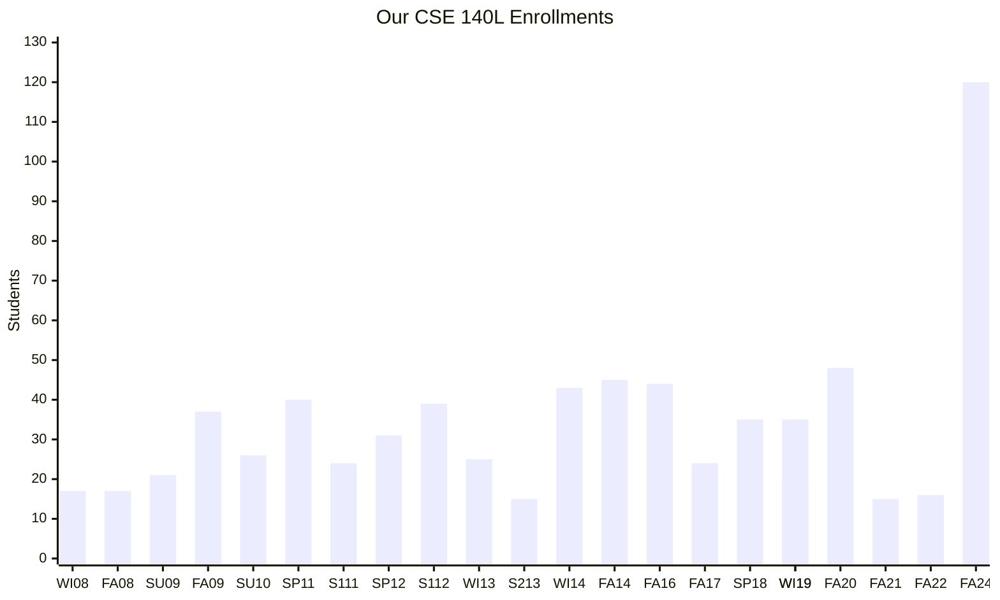

# Digital Systems Lab
<!-- {: .no_toc} -->

<!-- ## Contents -->
<!-- {: .no_toc .text-delta} -->
<!---->
<!-- 1. TOC -->
<!-- {:toc} -->

## Course Introduction

> Think about it, computers function by doing a bunch of simple things really really quickly. Crazy isn't it?

Digital logic is the foundation of modern computing, serving as the building block for everything from simple electronic devices to supercomputers.
At its core, digital logic involves the use of binary values (0s and 1s) to perform computations and process information.
Understanding digital logic is crucial for anyone interested in how computers work because it provides insights into how computers execute instructions, manage data, and solve problems. 

Everything you’ve learned so far has involved some form of code to make things happen, whether you were sorting a list or rendering a triangle.
This approach is fantastic for tackling complex problems, but when it comes to simpler tasks, relying on a fully coded solution might be a bit much.

Take, for instance, a vending machine.
Setting aside the motorized components, refrigeration system, and structural design the basic logic required to operate a vending machine is surprisingly straightforward.
In fact, you can understand and design the core functionality of a vending machine without writing a single line of code! This example highlights how fundamental digital logic can be, making it a powerful tool for grasping how even the simplest electronic systems work.

We hope that this course and topic interests and challenges you to think simply about problems that you face not only in your academics and career, but also in making decisions in life as well.

## Feedback
This quarter, we've seen a record number of enrollments in CSE 140L.
To accommodate this, we’ve developed a new scalable framework for teaching the course.
Since this is the first quarter implementing this system, we would greatly appreciate your feedback on how it’s working for you.

If you encounter any issues with the new framework, please let your TA know as soon as possible.
We hope you find the course both engaging and intellectually challenging.

CSE 140L Enrollment Data

Data was gathered from [UCSD CAPE](https://cape.ucsd.edu/responses/Results.aspx). 

